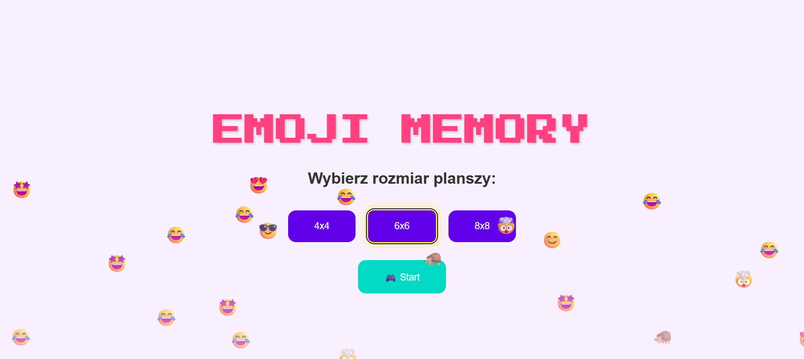

# Gra Emoji Memory

### Autor: Kacper Hołowaty

## Co jest potrzebne do uruchomienia aplikacji?

###### Baza danych MongoDB

Aplikacja korzysta z bazy danych, aby przechowywać informację o kontach graczy (nazwy użytkowników i hasła) oraz aby przechowywać historię gier, na której podstawie możliwe jest wyświetlenie najlepszych wyników uzyskanych przez graczy.

Do uruchomienia bazy danych można wykorzystać np. [Dockera](https://www.docker.com), uruchamiając w nim odpowiedni kontener.

Przykładowe polecenie, za pomocą którego można uruchomić bazę danych MongoDB w kontenerze:

````docker run -d \
    -p 27017:27017 \
    --name baza-danych \
    -v data-vol:/data/db \
    mongo:latest
````

## Uruchomienie

Należy otworzyć dwa oddzielne terminale:

1. W pierwszym należy wykonać następujące polecenia:

```
    cd client
    npm install
    npm start
```

Pozwoli to kolejno: przejść do katalogu z frontendem, zainstalować zależności niezbędne do uruchomienia projektu oraz uruchomić serwer React.

2. W drugim terminalu należy wykonać następujące polecenia:

```
    cd server
    npm install
    node server.js
```

Pozwoli to kolejno: przejść do katalogu z backendem, zainstalować zależności niezbędne do uruchomienia projektu oraz uruchomić serwer Express.

## Działanie i wygląd aplikacji:

Po uruchomieniu, aplikacja będzie dostępna pod adresem **http://localhost:3000** w przeglądarce.




