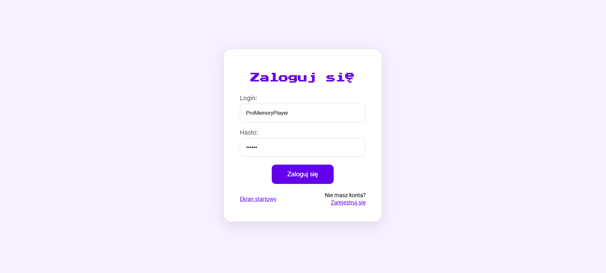

# Gra Emoji Memory

### Autor: Kacper Hołowaty

### Wersja DEMO: https://memory-emoji.netlify.app/

## Użyte technologie


## Uruchom lokalnie
#### Baza danych MongoDB

Aplikacja korzysta z bazy danych, aby przechowywać informację o kontach graczy (nazwy użytkowników i hasła) oraz aby przechowywać historię gier, na której podstawie możliwe jest wyświetlenie najlepszych wyników uzyskanych przez graczy.

Bazę można uruchomić w dedykowanych serwisach takich jak [MongoDB Atlas](https://www.mongodb.com/products/platform/atlas-database), ale można też wykorzystać np. [Dockera](https://www.docker.com), uruchamiając w nim odpowiedni kontener.

Przykładowe polecenie do wpisania w terminalu, za pomocą którego można uruchomić bazę danych MongoDB w kontenerze Docker:
````
  docker run -d \
    -p 27017:27017 \
    --name baza-danych \
    -v data-vol:/data/db \
    mongo:latest
````

#### Backend
1. Należy uruchomić terminal, a następnie przejść do katalogu z backendem, polecenie: `cd server`
2. Utworzenie pliku `.env`, przykładowa zawartość znajduje się w pliku `.env.example`
3. Zainstalowanie zależności za pomocą `npm install`
4. Uruchomienie za pomocą: `npm start` 

#### Frontend
1. Należy uruchomić nowy terminal, a następnie przejść do katalogu z frontendem, polecenie: `cd client`
2. Zainstalowanie zależności za pomocą `npm install`
3. Uruchomienie za pomocą: `npm start`

Po uruchomieniu, aplikacja będzie dostępna pod adresem **http://localhost:3000** w przeglądarce.

## O projekcie

Emoji Memory to aplikacja umożliwiająca grę w klasyczną grę memory. Gra oferuje wybór poziomu trudności poprzez wybór rozmiaru planszy: 4x4, 6x6 oraz 8x8.


Każdy użytkownik musi się zarejestrować lub zalogować na istniejące konto, aby rozpocząć grę.


W głównym panelu znajduje się plansza do gry oraz zegar odmierzający czas od rozpoczęcia rozgrywki. Zegar zatrzymuje się automatycznie po zakończeniu gry. Możliwe jest zapauzowanie gry poprzez naciśnięcie klawisza `Esc`.


Po ukończeniu gry wyświetla się uzyskany czas wraz z przyciskami umożliwiającymi:
- Wyświetlenie tablicy wyników
- Zakończenie gry (z wylogowaniem)
- Ponowną rozgrywkę (bez wylogowywania)


Tablica wyników prezentuje rezultaty wszystkich graczy posortowane od najlepszego do najgorszego czasu. Dostępne są filtry według nazwy gracza oraz poziomu trudności. Ostatni rezultat aktualnego gracza jest zawsze wyróżniony.


## Wdrożenie aplikacji

Aplikacja została wdrożona w środowisku produkcyjnym z wykorzystaniem trzech zewnętrznych usług:

- **Baza danych**: użyto [MongoDB Atlas](https://www.mongodb.com/products/platform/atlas-database), czyli chmurowej wersji MongoDB, umożliwiającej łatwe zarządzanie bazą danych i gwarantującej dostępność online.

- **Backend**: aplikacja serwerowa oparta na Node.js i Express.js została wdrożona na platformie [Render](https://render.com/), która automatycznie buduje i hostuje aplikacje backendowe na podstawie repozytorium kodu (np. GitHub).

- **Frontend**: interfejs użytkownika zbudowany w React został opublikowany na platformie [Netlify](https://www.netlify.com/), która zapewnia automatyczne budowanie i wdrażanie aplikacji frontendowych z repozytorium oraz obsługę HTTPS.

### Ciągła integracja i wdrażanie (CI/CD)

Aplikacja wykorzystuje automatyczne wdrażanie (**Continuous Deployment**):
- Każdy commit na głównym branchu (`master`) automatycznie uruchamia proces budowania i wdrażania
- Backend na Render automatycznie aktualizuje się po każdej zmianie w kodzie serwera
- Frontend na Netlify automatycznie przebudowuje i publikuje nową wersję po każdej zmianie w kodzie klienta

Dzięki temu każda zmiana w kodzie jest natychmiast dostępna w środowisku produkcyjnym bez konieczności ręcznego wdrażania.
